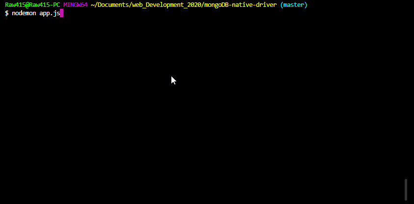

# mongoDB-native-driver

> Simple app to practice CRUD operations using mongoDB
___
### Table of Contents
- [Description](#description)
- [Usage](#usage)
- [Credits](#credits)
___
## Description

This simple app makes use of the mongoDB native driver to practice CRUD operations. Inserting documents into our local database, finding said documents and making use of the terminal to accomplish these tasks.

___
## Usage
Practice CRUD operations using mongoDB native driver
___
## Credits
- Dr. Angela Yu